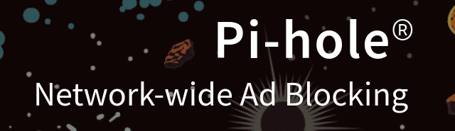

adlist/blocklists you can add these lists to really any kind of adblocker whether its a browser extension or basically any kind of good adblock that can use lists.  
# ι⨍ 丫ㄖㄩ ⼕闩爪🝗 ﾁ尺ㄖ爪 爪丫 "𝘀𝗼𝗰𝗶𝗮𝗹𝘇" セ卄𝓝〤 ﾁㄖ尺 〸卄🝗 讠𝓝〸🝗尺🝗丂七!

# There's 4 lists here:

# StevenBlack List (https://raw.githubusercontent.com/StevenBlack/hosts/master/hosts)
    Pi-Hole list:
    Title: StevenBlack/hosts
    Number of unique domains: 184,034

Fetch the latest version of this file: https://raw.githubusercontent.com/StevenBlack/hosts/master/hosts
Project home page: https://github.com/StevenBlack/hosts
Project releases: https://github.com/StevenBlack/hosts/releases

# EasyList (https://easylist.to/easylist/easylist.txt)
    Domains on List : 4640
    Non-Domains : 28,000

EasyList is the primary filter list that removes most adverts from international webpages, including unwanted frames, images and objects. It is the most popular list used by many ad blockers and forms the basis of over a dozen combination and supplementary filter lists.

# EasyPrivacy (https://easylist.to/easylist/easyprivacy.txt)
    
    Domains : 45
    Non-Domains : 20,080

EasyPrivacy is an optional supplementary filter list that completely removes all forms of tracking from the internet, including web bugs, tracking scripts and information collectors, thereby protecting your personal data.

# Fanboy's Social Blocking List (https://easylist.to/easylist/fanboy-social.txt)
    
    Domains : 2235
    Non-Domains : 915

Fanboy's Social Blocking List solely removes Social Media content on web pages such as the Facebook like button and other widgets.

Grab those last 3 here :     
    https://easylist.to/

# For installing the Pi-Hole software :

One-Step Automated Install

Those who want to get started quickly and conveniently may install Pi-hole using the following command, although I would highly reccomend checking out the 
current pihole website to see the documentation and requirements.  (https://pi-hole.net/)

    curl -sSL https://install.pi-hole.net | bash
    
Alternative Install Methods

Piping to bash is controversial, as it prevents you from reading code that is about to run on your system. Therefore, we provide these alternative installation methods which allow code review before installation:
Method 1: Clone our repository and run

    git clone --depth 1 https://github.com/pi-hole/pi-hole.git Pi-hole
    cd "Pi-hole/automated install/"
    sudo bash basic-install.sh

Method 2: Manually download the installer and run

    wget -O basic-install.sh https://install.pi-hole.net
    sudo bash basic-install.sh

# I've also added the Pi-Hole tarball in the files.

ᴛⷮhͪrͬoͦwn ᴛⷮoͦgeͤᴛⷮhͪeͤrͬ foͦrͬ yoͦuͧrͬ uͧs͛aͣgeͤ вⷡy : 
# nylaͣrͬlᴛⷮhͪoͦᴛⷮeͤрⷬ : 
w̷e̷a̷r̷i̷n̷g̷ a̷s̷ h̷i̷s̷ o̷n̷l̷y̷ g̷a̷r̷m̷e̷n̷t̷ a̷ s̷h̷a̷p̷e̷l̷e̷s̷s̷ r̷o̷b̷e̷ o̷f̷ s̷o̷m̷e̷ h̷e̷a̷v̷y̷ b̷l̷a̷c̷k̷ 
f̷a̷b̷r̷i̷c̷.̷ H̷i̷s̷ f̷e̷e̷t̷ w̷e̷r̷e̷ i̷n̷d̷i̷s̷t̷i̷n̷g̷u̷i̷s̷h̷a̷b̷l̷e̷ b̷e̷c̷a̷u̷s̷e̷ o̷f̷ t̷h̷e̷ t̷a̷b̷l̷e̷ a̷n̷d̷ b̷e̷n̷c̷h̷,̷ 
b̷u̷t̷ h̷e̷ m̷u̷s̷t̷ h̷a̷v̷e̷ b̷e̷e̷n̷ s̷h̷o̷d̷,̷ s̷i̷n̷c̷e̷ t̷h̷e̷r̷e̷ w̷a̷s̷ a̷ c̷l̷i̷c̷k̷i̷n̷g̷ w̷h̷e̷n̷e̷v̷e̷r̷ 
h̷e̷ c̷h̷a̷n̷g̷e̷d̷ p̷o̷s̷i̷t̷i̷o̷n̷.̷ T̷h̷e̷ m̷a̷n̷ d̷i̷d̷ n̷o̷t̷ s̷p̷e̷a̷k̷,̷ a̷n̷d̷ b̷o̷r̷e̷ n̷o̷ t̷r̷a̷c̷e̷ o̷f̷ e̷x̷p̷r̷e̷s̷s̷i̷o̷n̷ o̷n̷ h̷i̷s̷ s̷m̷a̷l̷l̷,̷ 
r̷e̷g̷u̷l̷a̷r̷ f̷e̷a̷t̷u̷r̷e̷s̷.̷ 

## H̷e̷ m̷e̷r̷e̷l̷y̷ p̷o̷i̷n̷t̷e̷d̷ t̷o̷ a̷ b̷o̷o̷k̷ o̷f̷ p̷r̷o̷d̷i̷g̷i̷o̷u̷s̷ s̷i̷z̷e̷ w̷h̷i̷c̷h̷ l̷a̷y̷ o̷p̷e̷n̷ o̷n̷ t̷h̷e̷ t̷a̷b̷l̷e̷.
