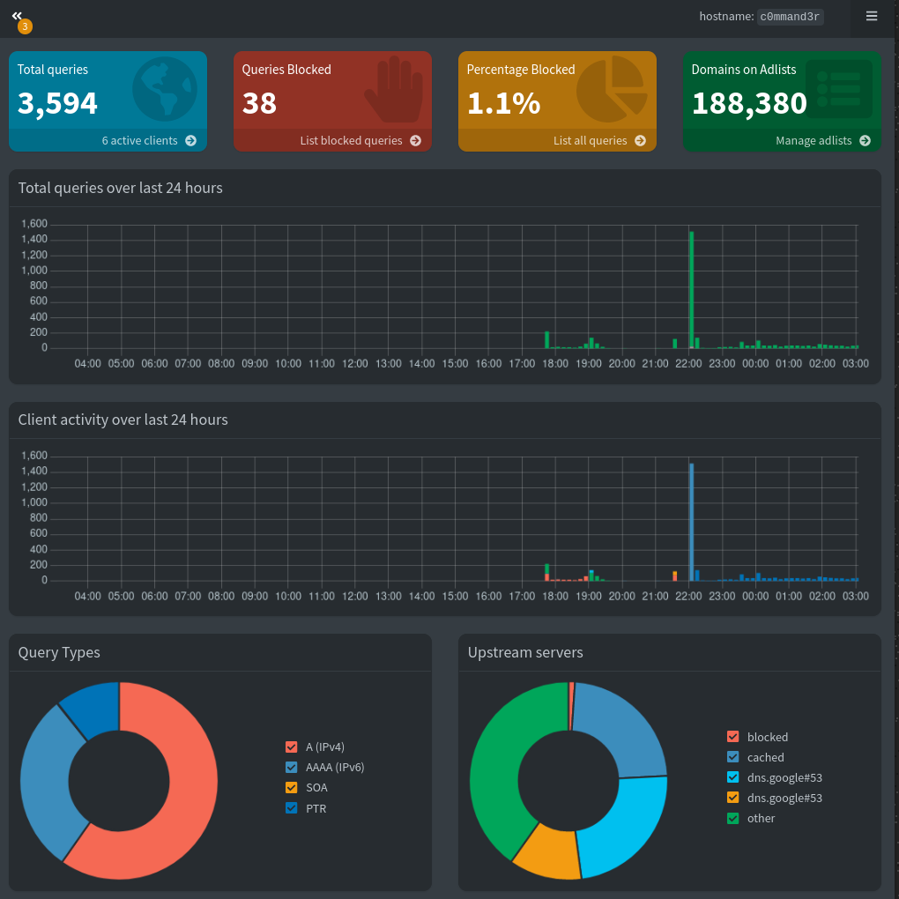
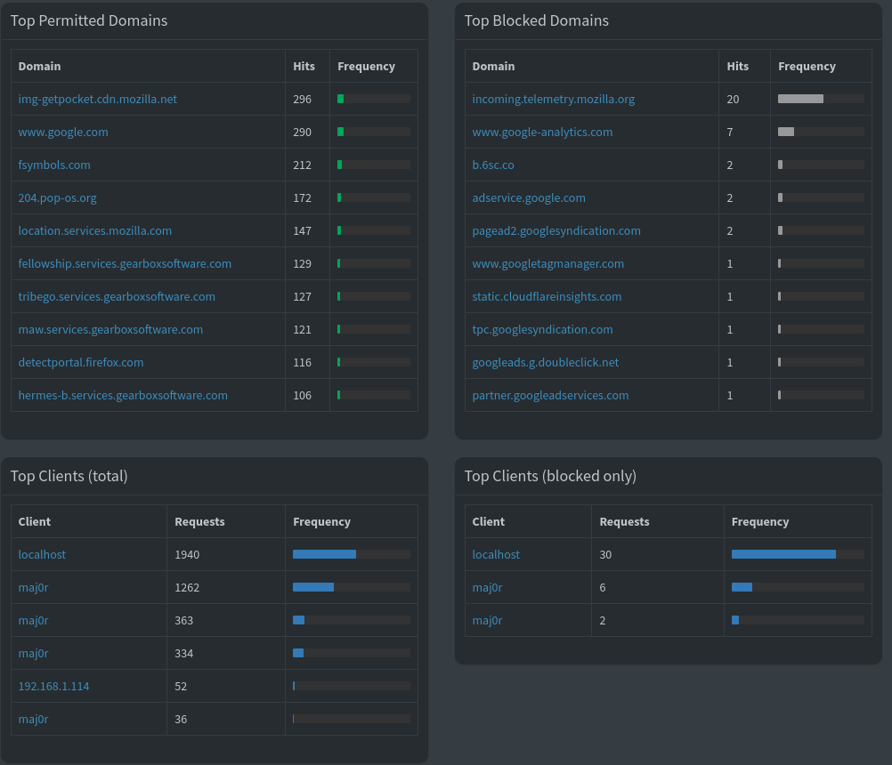
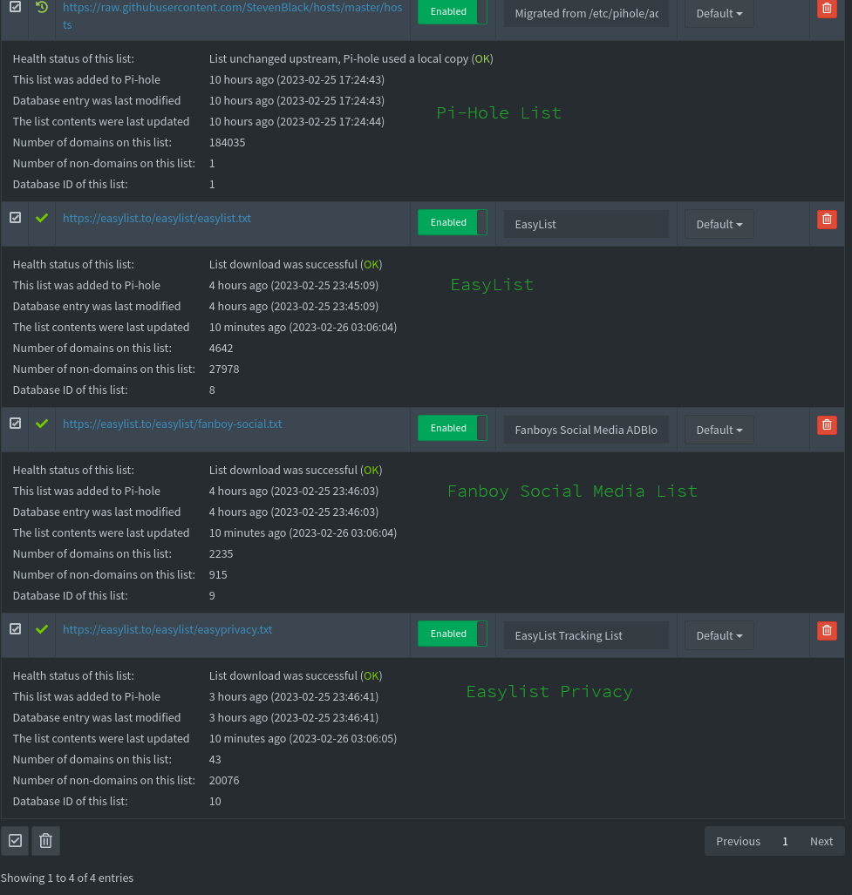

# blackhole_blocklists
Pi-Hole adlists for blocking

There's 4 lists here:

Pi-Hole list:
 Title: StevenBlack/hosts
 Number of unique domains: 184,034
# Fetch the latest version of this file: https://raw.githubusercontent.com/StevenBlack/hosts/master/hosts
# Project home page: https://github.com/StevenBlack/hosts
# Project releases: https://github.com/StevenBlack/hosts/releases

EasyList

EasyList is the primary filter list that removes most adverts from international webpages, including unwanted frames, images and objects. It is the most popular list used by many ad blockers and forms the basis of over a dozen combination and supplementary filter lists.

EasyPrivacy

EasyPrivacy is an optional supplementary filter list that completely removes all forms of tracking from the internet, including web bugs, tracking scripts and information collectors, thereby protecting your personal data.

Fanboy's Social Blocking List
Fanboy's Social Blocking List solely removes Social Media content on web pages such as the Facebook like button and other widgets.
